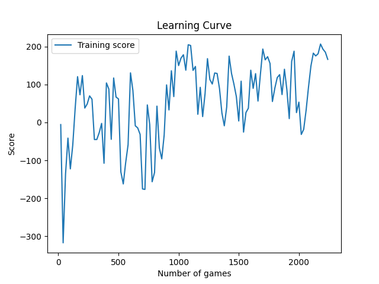

# Reinforcement Learning - Lunar Lander

This repository contains the implementation of a Reinforcement Learning algorithm using Gym's "LunarLander-v2" environment.

## Project Description

The goal of this project is to train an AI agent to pilot a lunar landing module in the game "Lunar Lander". The agent learns through interaction with the environment, observing the current state and taking actions to maximize the score obtained.

## Dependences

- Python 3.x
- PyTorch
- Gym

## Code Structure

The code for the Actor-Critic model found in the `AC` folder is organized in the following files:

- `utils.py`: Contains utility functions for loss calculation, action selection and learning curve tracking.
- `network.py`: Contains neural network definitions used for policy and state value.
- `train.py`: The main file that starts agent training on the Lunar Lander game.
- `test.py`: The file that starts the agent's test on the Lunar Lander game.

During training, the agent uses the Actor-Critic (AC) algorithm to improve its performance. The neural network for policy (Policy Network) learns to select actions based on observed states, while the neural network for state value (State Value Network) estimates the value of a state.

## Results

The average scores obtained by the agent are recorded and displayed periodically. At the end of training, the learning curve is plotted and saved as an image `learning_curve.png`. In addition, the weights of the trained neural networks are saved in separate files for policy and state value.

