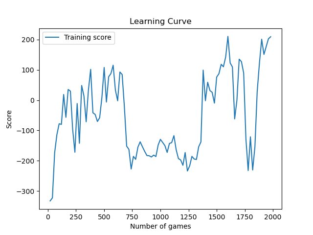

# Reinforcement Learning - Lunar Lander

This repository contains the implementation of a Reinforcement Learning algorithm using Gym's "LunarLander-v2" environment.

## Project Description

The goal of this project is to train an AI agent to pilot a lunar landing module in the game "Lunar Lander". The agent learns through interaction with the environment, observing the current state and taking actions to maximize the score obtained.

## Dependences

- Python 3.x
- PyTorch
- Gym

## Code Structure

The code for the each model found in the 'A2C' and 'PPO' folder is organized in the following files:

- `utils.py`: Contains utility functions for loss calculation, action selection and learning curve tracking.
- `network.py`: Contains neural network definitions used for policy and state value.
- `train.py`-`main.py`: The main file that starts agent training on the Lunar Lander game.
- `test.py`: The file that starts the agent's test on the Lunar Lander game.

For the A2C implementation during training, the agent uses the Advantage Actor Critic (A2C) algorithm to improve its performance. The neural network for policy (Value) learns to select actions based on observed states, while the neural network for state value (Critic) estimates the value of a state.

For the PPO implementation during training, the agent uses the Proximal Policy Optimization (PPO) algorithm to improve its performance. The neural network for policy (Value) learns to select actions based on observed states, while the neural network for state value (Actor) estimates the value of a state. And a ratio is used to compare the old policy with the new one, based on a clip.

## Results

The average scores obtained by the agent are recorded and displayed periodically. At the end of training, the learning curve is plotted and saved as an image. In addition, the weights of the trained neural networks are saved in separate files. Below it is possible to check the performance of both methods.
|  |  |
|:--:|:--:|
| *Image 1: A2C* | *Image 2: PPO* |

